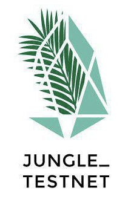

	

	
	

## Description 
EOS Jungle Testnet Documentation Website [docs.jungletestnet.io](http://docs.jungletestnet.io)

## Contributing

We use a Kanban-style board to prioritize the work. [Go to Project Board](https://github.com/EOS-Jungle-Testnet/docs.jungletestnet.io/projects/1).

The main communication channels are [github issues](https://github.com/EOS-Jungle-Testnet/docs.jungletestnet.io/issues) and the [Jungle's Discord server](https://discord.gg/84REyeN). Feel to join and ask as many questions you may have.

Contributing Guidelines. [https://developers.eoscostarica.io/docs/open-source-guidelines](https://developers.eoscostarica.io/docs/open-source-guidelines).

Please report bugs big and small by [opening an issue](https://github.com/EOS-Jungle-Testnet/docs.jungletestnet.io/issues).

## Weekly Call

Our weekly sync call is every Friday 3pm UTC at [meet.eoscostarica.io](https:/meet.eoscostarica.io).

- Please review our weekly meeting agenda agenda and minutes in the following shared [Google Drive Folder](https://drive.google.com/drive/folders/1AoXnpLLyF84GWfK91xR42kouDnbPL3Dw?usp=sharing)

## License

MIT © [Jungle Testnet](https://jungletestnet.io)  